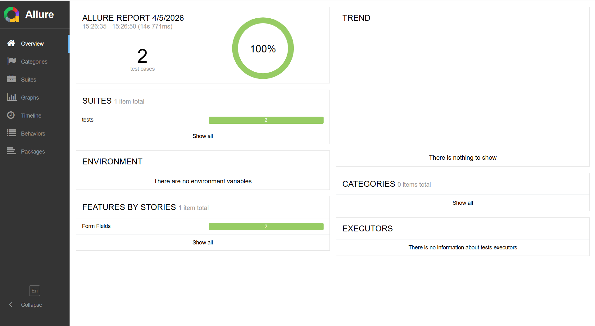

# SimbirSoft SDET — UI Automation Project

## Стек технологий
- Python 3.10
- Selenium WebDriver 4
- PyTest
- Allure Reports
- webdriver-manager

## Паттерны проектирования
- **Page Object Model** — каждая страница представлена отдельным классом
- **Page Factory** — локаторы инициализируются в конструкторе страницы
- **Fluent Interface** — методы страницы возвращают `self` для цепочки вызовов

## Запуск тестов

### Установка зависимостей
```bash
pip install -r requirements.txt
```

### Запуск
```bash
pytest --alluredir=allure-results -v
```

### Просмотр отчёта
```bash
allure serve allure-results
```

## Allure Report


---

## Тест-кейсы

### TC-001: Позитивный — успешная отправка формы

| Поле | Значение |
|------|----------|
| **ID** | TC-001 |
| **Название** | Успешная отправка формы с валидными данными |
| **Приоритет** | Высокий |
| **Тип** | Позитивный |

**Предусловие:**
1. Открыт браузер Chrome
2. Выполнен переход по адресу https://practice-automation.com/form-fields/

**Шаги:**

| # | Шаг | Ожидаемый результат |
|---|-----|---------------------|
| 1 | Ввести в поле Name: `Test User` | Поле заполнено |
| 2 | Ввести в поле Password: `Test1234` | Поле заполнено |
| 3 | Установить чекбоксы Milk и Coffee | Оба чекбокса отмечены |
| 4 | Выбрать из dropdown цвет Yellow | Yellow выбран |
| 5 | Выбрать radio-button Yes | Опция выбрана |
| 6 | Ввести в Email: `testuser@example.com` | Поле заполнено |
| 7 | Ввести в Message: `5 Katalon Studio` | Поле заполнено |
| 8 | Нажать кнопку Submit | — |

**Ожидаемый результат:**
Появляется алерт с текстом `Message received!`

---

### TC-002: Негативный — отправка формы с невалидным email

| Поле | Значение |
|------|----------|
| **ID** | TC-002 |
| **Название** | Попытка отправки формы с некорректным email |
| **Приоритет** | Средний |
| **Тип** | Негативный |

**Предусловие:**
1. Открыт браузер Chrome
2. Выполнен переход по адресу https://practice-automation.com/form-fields/

**Шаги:**

| # | Шаг | Ожидаемый результат |
|---|-----|---------------------|
| 1 | Ввести в поле Name: `Test User` | Поле заполнено |
| 2 | Ввести в поле Password: `Test1234` | Поле заполнено |
| 3 | Установить чекбоксы Milk и Coffee | Оба чекбокса отмечены |
| 4 | Выбрать из dropdown цвет Yellow | Yellow выбран |
| 5 | Выбрать radio-button Yes | Опция выбрана |
| 6 | Ввести в Email: `not-an-email` | Поле заполнено некорректным значением |
| 7 | Ввести в Message: `5 Katalon Studio` | Поле заполнено |
| 8 | Нажать кнопку Submit | — |

**Ожидаемый результат:**
Форма не отправляется, браузер подсвечивает поле Email как некорректное, алерт `Message received!` не появляется.